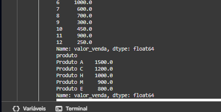
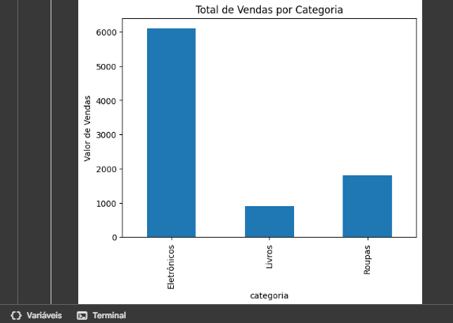
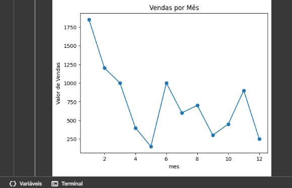

#  ATIVIDADE PRÁTICA - Análise de Vendas e Insights  

---

*A recomendação da minha instituição foi utilizar o Google Colab para desenvolver o código e executá-lo.*

---

## A ORIENTAÇÃO DO PROJETO FOI A SEGUINTE:

Você trabalha em uma empresa de varejo e precisa analisar os dados de vendas do último ano
para identificar padrões e insights para melhorar o desempenho. Os dados estão armazenados
em um banco de dados SQLite, e você utilizará a biblioteca Pandas para manipular e analisar
esses dados, além de gerar visualizações utilizando Matplotlib e Seaborn.

ㅤ
ㅤ

### Passo 1: Conectar ao banco de dados SQLite e criar uma tabela

### Passo 2: Explorar e preparar os dados
- Agora que os dados estão carregados em um DataFrame do Pandas (df_vendas), você
pode explorá-los e prepará-los para análise.

### Passo 3: Análise dos dados
- Realize análises específicas para extrair insights sobre as vendas.

### Passo 4: Visualização dos dados
- Utilize Matplotlib e Seaborn para criar visualizações que ajudem na interpretação dos
resultados.

### Passo 5: Conclusão e análise de insights
- Finalize o exercício com uma breve análise dos insights obtidos e sugestões para a
empresa com base nos dados analisados.

---

## Vamos começar mostrando meu código por completo!

Você pode acompanhar pela imagem abaixo ou pelo arquivo aqui no github ---> [Arquivo do Projeto](https://github.com/lukkyzdev/Analise-de-Vendas-e-Insights/blob/main/Análise%20de%20Vendas%20e%20Insights.py)

 

## Execução do Código e Explicações

> Prints do Código em Execução

### Conclusão

- *A análise dos dados de vendas mostrou que a categoria Eletrônicos foi
a mais lucrativa ao longo do ano, concentrando a maior parte do
faturamento.*

- *A categoria Roupas apresentou vendas consistentes, mas em valores
médios, enquanto Livros tiveram menor impacto no total de receitas.*

- *Também foi possível observar uma variação nas vendas ao longo dos
meses, sugerindo certa sazonalidade.*

- *Esses insights indicam que a empresa deve manter o foco em
eletrônicos, buscar estratégias para aumentar o ticket médio em roupas e
investir em campanhas promocionais para impulsionar as vendas de
livros.**
